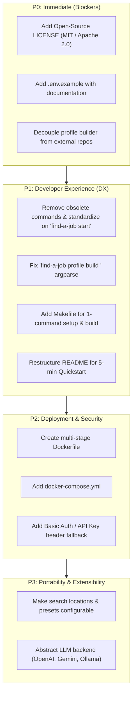

# Find a Job: GitHub & Community Readiness Roadmap

This document outlines the evaluation, gap analysis, and step-by-step roadmap required to make Find a Job turnkey, portable, and accessible for any GitHub user.

---

## 1. Executive Summary & Readiness Assessment

Find a Job has an exceptionally strong technical core:
- **Rock-solid test coverage**: 494 Python unit/integration tests and 43 Vitest frontend tests.
- **Strict code quality**: 0 Ruff lint issues, 0 Pyright type errors.
- **Architectural maturity**: Robust SQLite WAL data layer, LangGraph agent workflows, prefix-cache optimized LLM calls, and a responsive Preact/TypeScript dashboard.

However, the repository currently reflects a **single-user personal setup** rather than a reusable open-source product. The gaps fall into five key areas:
1. **Legal & Open-Source Governance**: No open-source license.
2. **Onboarding & Configuration Ergonomics**: External private corpus dependencies, missing `.env.example`, and undocumented environment variables.
3. **CLI & Documentation Alignment**: Discrepancies between commands in `README.md` and `careerradar/cli.py` (`careerradar web` vs `careerradar start`, missing flags).
4. **Geographic & Role Portability**: Hardcoded US/Nordic target locations and recruiting agency filters.
5. **Deployment & Authentication Portability**: Tight coupling to Tailscale Serve and host-specific systemd paths, with no Docker containerization.

---

## 2. Prioritized Roadmap & Action Items



---

## Phase 1: Legal & First-Run Onboarding (P0 — Immediate)

### 1.1. Add Open-Source License
- **Action**: Add a `LICENSE` file at the repository root.
- **Recommendation**: **MIT License** or **Apache 2.0 License** for maximum adoption and clarity.

### 1.2. Provide `.env.example`
- **Action**: Add `.env.example` with clear comments explaining required and optional variables:
  ```env
  # Required: DeepSeek API key for profile extraction, scoring, and research
  DEEPSEEK_API_KEY=sk-...

  # Optional: Tavily API key for company web research and contact discovery
  TAVILY_API_KEY=tvly-...

  # Optional: Rotating proxy pool (required for full LinkedIn description scrapes)
  # Format: "user:pass@host:port" or "user:pass@host1:port,user:pass@host2:port"
  # SCRAPER_PROXIES=

  # Optional: Tailscale login permitted to access the dashboard
  # Leave blank for local-only access (127.0.0.1)
  FIND_A_JOB_OWNER=
  ```

### 1.3. Streamline Candidate Profile Ingestion
- **Fixes**:
  1. Update `careerradar/cli.py` so `find-a-job profile build` takes an optional file argument:
     ```bash
     find-a-job profile build ./path/to/my_resume.pdf
     ```
  2. Document the web UI's **Resume Dropzone** (`/resumes` route) as the visual alternative for profile extraction.
  3. Include a sanitized sample resume or template document in `examples/sample_resume.md` so users without an immediate PDF can test the pipeline immediately.

---

## Phase 2: CLI Consistency & Build Automation (P1 — High)

### 2.1. Align CLI Subcommands with Documentation
- **Action**: Standardize on `find-a-job start` across all documentation and purge obsolete commands (`web`, `score rescale`, `score audit`, `search cost`, `score stats`).
- **Audit**: All flags referenced in documentation (`search run --dry-run`, `score run --limit`, `migrate`, `status`) match `careerradar/cli.py` exactly.

### 2.2. Single-Step Setup & Build Automation (`Makefile`)
- **Fix**: Add a root `Makefile` for one-command installation, build, and test.

### 2.3. Restructure `README.md`
- Provide a clear, top-level **"⚡ Quickstart (5 Minutes)"** section:
  1. Clone & install dependencies (`make setup && make build`)
  2. Configure `.env` (`cp .env.example .env`)
  3. Initialize database (`uv run find-a-job migrate`)
  4. Ingest resume (`uv run find-a-job profile build examples/sample_resume.md`)
  5. Start app (`make start`)
- Move deep technical essays (DeepSeek pricing analysis, LinkedIn guest API pagination benchmarks, Pareto score theory) into dedicated subheadings or `docs/` files to keep the main README accessible.

---

## Phase 3: Deployment & Authentication Portability (P1 — High)

### 3.1. Containerization (`Dockerfile` and `docker-compose.yml`)
- **Action**: Create a multi-stage `Dockerfile`:
  ```dockerfile
  # Stage 1: Build Frontend Assets
  FROM node:24-slim AS frontend-builder
  WORKDIR /app
  COPY package.json package-lock.json tsconfig.json vite.config.ts ./
  COPY careerradar/web/frontend-src/ ./careerradar/web/frontend-src/
  RUN npm ci && npm run build

  # Stage 2: Python Runtime
  FROM python:3.12-slim
  WORKDIR /app
  COPY --from=ghcr.io/astral-sh/uv:latest /uv /bin/uv
  COPY pyproject.toml uv.lock README.md ./
  COPY careerradar/ ./careerradar/
  COPY data/ ./data/
  COPY templates/ ./templates/
  COPY config.yaml ./config.yaml
  COPY --from=frontend-builder /app/careerradar/web/frontend/dist/ ./careerradar/web/frontend/dist/

  RUN uv sync --frozen --no-dev
  ENV PATH="/app/.venv/bin:$PATH"

  EXPOSE 8010
  CMD ["find-a-job", "start", "--host", "0.0.0.0", "--port", "8010"]
  ```

- **Action**: Provide a turn-key `docker-compose.yml`:
  ```yaml
  services:
    find-a-job:
      build: .
      ports:
        - "8010:8010"
      env_file:
        - .env
      volumes:
        - ./data:/app/data
        - ./jobs.db:/app/jobs.db
        - ./graphs.db:/app/graphs.db
        - ./config.yaml:/app/config.yaml
      restart: unless-stopped
  ```

### 3.2. Universal Web Authentication
- **Problem**: `careerradar/web/app.py` enforces `FIND_A_JOB_OWNER` by inspecting the `tailscale-user-login` header. Non-Tailscale users deploying behind standard reverse proxies (Nginx, Caddy, Cloudflare, Traefik) have no built-in auth mechanism.
- **Fix**: Extend `careerradar/web/app.py` with optional Basic Auth or API Token authentication:
  - If `FIND_A_JOB_PASSWORD` or `FIND_A_JOB_AUTH_TOKEN` is set, validate HTTP Basic Auth or `Authorization: Bearer <token>` / cookie before serving the dashboard.

---

## Phase 4: Localization & Model Flexibility (P2 — Medium)

### 4.1. Configurable Search Locations & Currency Presets
- **Context**: Target roles, queries, and locations have been migrated from the legacy `data/roles.yaml` file into SQLite database tables (`target_roles`, `target_queries`, `target_locations`) and are dynamically manageable via the Target Roles UI and CLI (`careerradar target add/list/toggle`).
- **Remaining Improvements**:
  1. Provide regional starter configuration presets (e.g. `presets/us_tech.json`, `presets/uk_europe.json`, `presets/remote_only.json`) that can be imported via CLI/UI.
  2. Externalize Nordic-specific exclusions (`Netcompany`, `Consid`, `HiQ`, `Cygni`) and Swedish regexes (`nybörjare`, `erfaren`) into configurable exclusion rules.
  3. Ensure exchange rates under `scraper.fx` in `config.yaml` are easily customizable for other currencies (GBP, CAD, AUD, INR, etc.).

### 4.2. Multi-LLM Provider Extensibility
- **Problem**: `careerradar/core/llm.py` directly imports and configures `ChatDeepSeek` (`langchain-deepseek`).
- **Fix**: Introduce a provider router in `careerradar/core/llm.py`:
  - Support `LLM_PROVIDER`: `deepseek` (default, lowest cost), `openai` (`gpt-4o-mini`), `anthropic` (`claude-3-5-haiku`), `gemini` (`gemini-2.5-flash`), and `ollama` / `openai-compatible` base URLs.

---

## 3. Implementation Checklist

- [x] Add `LICENSE` (MIT).
- [x] Add `.env.example`.
- [x] Standardize on `find-a-job start` and remove obsolete commands from documentation.
- [x] Fix `find-a-job profile build [file]` argument parsing in `careerradar/cli.py`.
- [x] Add `Makefile` for one-command install/build/start.
- [x] Add `Dockerfile` and `docker-compose.yml`.
- [x] Add optional Basic Auth / Bearer token gate in `careerradar/web/app.py`.
- [x] Reorganize `README.md` with a clean 5-minute Quickstart.
- [ ] Add `.github/ISSUE_TEMPLATE/` and `CONTRIBUTING.md`.
