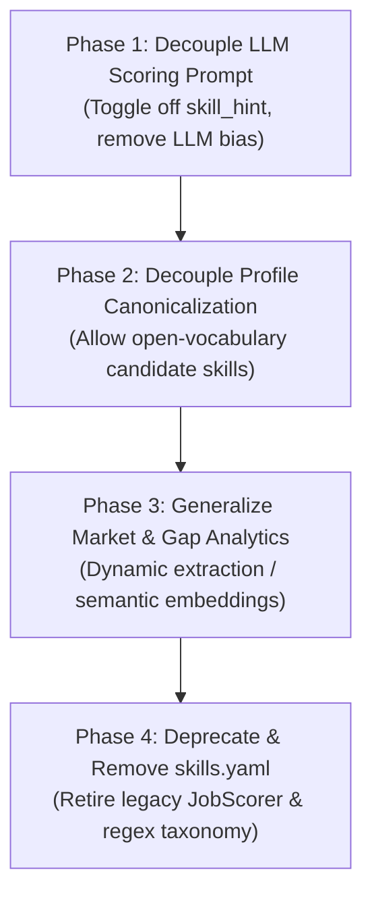

# Architectural Plan: Decoupling from `skills.yaml`

## 1. Executive Summary & Problem Statement

CareerRadar transitioned from an early deterministic keyword-matching system (`JobScorer`, BM25) to an LLM-agentic pipeline for candidate-job fit evaluation. However, the static taxonomy file (`data/skills.yaml`) remains embedded across several core components.

Retaining this hardcoded taxonomy introduces three significant architectural issues:

1. **Prevents Generalization Across Industries:**
   * `skills.yaml` hardcodes 172 skills exclusively for software engineering, DevOps, and cloud/AI infrastructure.
   * Applying CareerRadar to any other discipline (e.g., healthcare, finance, legal, sales, biotechnology) currently requires authoring and maintaining a massive custom YAML file.
   * Even within software engineering, it requires perpetual manual maintenance as new frameworks, tools, and languages emerge.

2. **Regex Extraction is Brittle:**
   * Standard regex token boundaries (`\b`) fail on non-alphanumeric tokens (e.g., `C++`, `C#`, `.NET`).
   * Short tokens (`go`, `r`, `ray`, `spark`) suffer from high false-positive rates, requiring fragile heuristics like `strict_aliases` constrained to a 120-character proximity context window.
   * Keyword matching fails on natural semantic phrasing (e.g., *"architecting event-driven pipelines"* fails to match `kafka` unless explicitly written).

3. **Anchoring Bias in LLM Scoring:**
   * In `careerradar/scoring/prompts.py`, the scoring prompt injects a `<taxonomy_signal>` section listing *"candidate profile has: ... / posting asks, not on profile: ..."*.
   * This explicit diff primes the LLM with a checklist mindset, nudging it to penalize candidates for missing superficial keywords rather than assessing transferable skills, seniority slope, and holistic fit.

---

## 2. Current Footprint of `data/skills.yaml`

Before refactoring, the components relying on `data/skills.yaml` and `Taxonomy` must be mapped:

| Subsystem | File(s) | Role of `skills.yaml` |
| :--- | :--- | :--- |
| **Scoring Prompt** | `careerradar/scoring/prompts.py`, `careerradar/scoring/worker.py` | Injects `<taxonomy_signal>` (`evidenced` vs `missing` skills) into the LLM prompt. |
| **Search Ingestion** | `careerradar/search/runner.py` | Scans job descriptions via `taxonomy.extract()` and writes canonical skill IDs into the `job_skills` table. |
| **Market Analytics** | `careerradar/market/gap_analysis.py`, `careerradar/market/repository.py` | Aggregates skill demand, blocking gaps, and salary lift from `job_skills`. |
| **Profile Ingestion** | `careerradar/profile/builder.py` | Canonicalizes resume/interview skill strings via `taxonomy.canonicalize()`. |
| **Eligibility Blockers** | `careerradar/taxonomy/skills.py` | Defines clearance regex patterns (`blockers:` section like `top_secret`, `polygraph`). |
| **Audit & Integrity** | `careerradar/core/status_repository.py` | Uses `taxonomy.hash` in `jobs.taxonomy_hash` and `sync_runs` to detect taxonomy drift. |

---

## 3. Phased Implementation Roadmap

To avoid breaking active scraping and dashboard analytics, the migration should follow a 4-phase rollout:



---

### Phase 1: Decouple LLM Scoring from `skill_hint` (Immediate / Low Risk)

**Goal:** Eliminate LLM anchoring bias immediately with minimal code changes.

1. **Add Configuration Toggle in `config.yaml`:**
   ```yaml
   scoring:
     include_skill_hint: false  # Default to false to eliminate prompt bias
   ```
2. **Update `careerradar/scoring/worker.py`:**
   * In `_skill_hint()`, respect the configuration flag:
     ```python
     if not config.get("scoring", {}).get("include_skill_hint", False):
         return ""
     ```
   * When disabled, `render_posting()` simply outputs the raw posting `<title>`, `<company>`, `<location>`, `<facts>`, and `<description>` without `<taxonomy_signal>`.
3. **Verification:**
   * Run metamorphic evaluations (`uv run python -m evals.metamorphic`) to verify that verdict quality and reasoning fidelity improve or hold steady.
   * Compare verdict distributions on sample backlog jobs with and without the hint.

---

### Phase 2: Decouple Profile Generation from Static Taxonomy

**Goal:** Allow candidates to define skills openly across any domain or industry without requiring entries in `skills.yaml`.

1. **Update `careerradar/profile/builder.py`:**
   * Currently, `taxonomy.canonicalize()` filters and drops unrecognized skills.
   * Switch to open-vocabulary extraction: allow the profile builder LLM to extract normalized skill strings directly from resumes without dropping skills not present in `skills.yaml`.
2. **Preserve Subsumption in Profile:**
   * Replace the hardcoded `implies:` graph in YAML with LLM-generated related capabilities or hierarchical grouping within the profile JSON.

---

### Phase 3: Generalize Market & Gap Analytics

**Goal:** Remove dependence of `job_skills` and market reporting on a 1,000-line hardcoded regex file.

1. **Option A (Target-Driven Extraction):**
   * Instead of a global 172-skill taxonomy, drive extraction based on the candidate's active `target_roles` and profile skills.
   * Only extract and track skills relevant to the user's career domain.
2. **Option B (Zero-Shot / Embedding Extraction):**
   * Use a lightweight zero-shot model or local embedding model (e.g., `FastEmbed` / `bge-small-en`) to extract technical terms or match job description vectors against candidate profile vectors.
3. **Migrate Hard Blocker Patterns:**
   * Move the `blockers:` section from `skills.yaml` into explicit candidate dealbreakers in `profile.dealbreakers_json` or a streamlined configuration block.

---

### Phase 4: Deprecate and Retire `data/skills.yaml`

**Goal:** Clean removal of the legacy scaffold.

1. Retire `careerradar/search/keyword_score.py` (`JobScorer`).
2. Deprecate `jobs.taxonomy_hash` or re-point it to track `profile_version` and `prompt_hash`.
3. Safely remove `data/skills.yaml` and simplify `careerradar/taxonomy/`.

---

## 4. Key Metrics for Success

* **Domain Agnosticism:** The system can be configured for non-tech roles (e.g. Registered Nurse, Corporate Counsel) with zero modifications to python or YAML files.
* **Scoring Accuracy:** Metamorphic test pass rate remains at 100%, with lower rates of false-negative rejections caused by missing keyword synonyms.
* **Maintainability:** Elimination of regex edge cases (`strict_aliases`, `context` windows, token boundary regexes).
